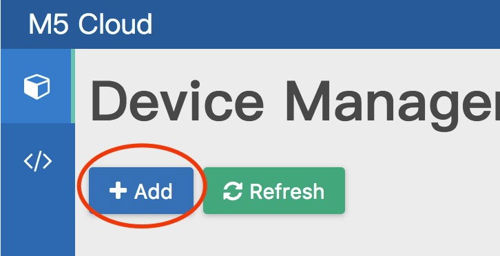
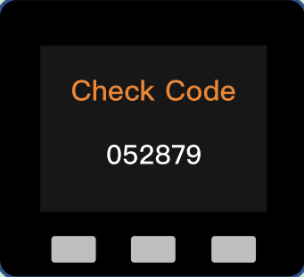
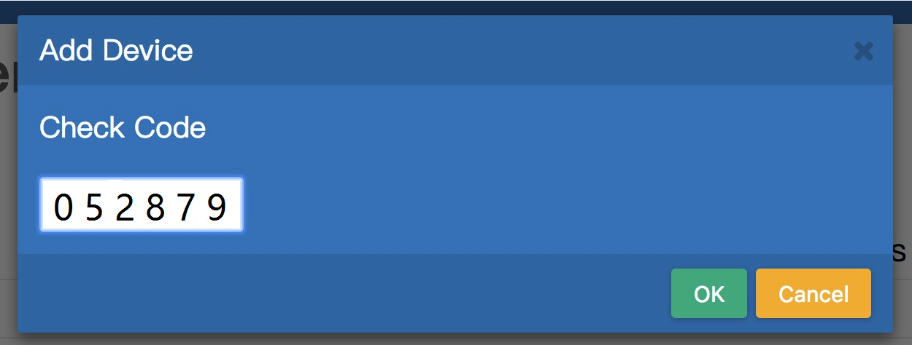
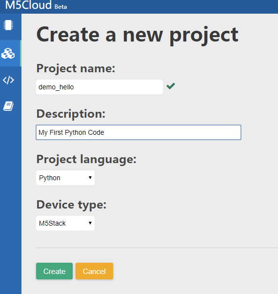

## Download M5Cloud Firmware to M5Stack board
### 1. Download M5Cloud Firmware from Github
https://github.com/m5stack/M5Cloud/tree/master/firmwares

Now, the M5Cloud firmware I downloaded named `m5cloud-20180516-v0.4.0.bin`
And `m5cloud-20180516-v0.4.0.bin` saved at `~/smbshare`, as shown below


### 2. M5Cloud Firmware to M5Stack board
 |  |  
---|--- | ---
Windows | Linux | MacOS 

***Windows***


***MacOS/Linux***
**1. Check port on Linux and MacOS**

  To check the device name for the serial port of your M5Stack board (or external converter dongle), run this command two times, first with the board / dongle unplugged, then with plugged in. The port which appears the second time is the one you need:

  Linux

  ```
  ls /dev/tty*
  ```
  
  MacOS

  ```
  ls /dev/cu.*
  ```


**2. Adding user to `dialout` on Linux**

The currently logged user should have read and write access the serial port over USB. On most Linux distributions, this is done by adding the user to `dialout` group with the following command:

  ```
  sudo usermod -a -G dialout $USER
  ```
Now, my serial port named `ttyUSB0`, as shown below


[^_^]:
    TODO: put a picture here


**2. Download M5Cloud firmware to M5Stack board**

* Installing esptool：
```
pip install esptool
```

* Erase flash on M5Stack:

```
esptool.py --chip esp32 --port /dev/ttyUSB0 erase_flash
```

* Download firmware to M5Stack: 

```
esptool.py --chip esp32 --port /dev/ttyUSB0 write_flash --flash_mode dio -z 0x1000 m5cloud-20180516-v0.4.0.bin
```

Now, my PC terminal, as shown below


    
## M5Stack board connect io.m5stack.com via Wi-Fi


**1. connect to M5Stack AP**


**2. Use Mobile Phone or PC browser login 192.168.4.1 setting the SSID and Password**

your M5Stack LCD Interface


login 192.168.4.1 setting the SSID and Password


## Binding device

**1. login io.m5stack.com and register your own account(or login your account)**


**2. binding this M5Stack board to your account**



**3. Input the Check Code for the M5Stack screen display，Check Code is random,after 60s will refresh**





## Coding MicroPython



