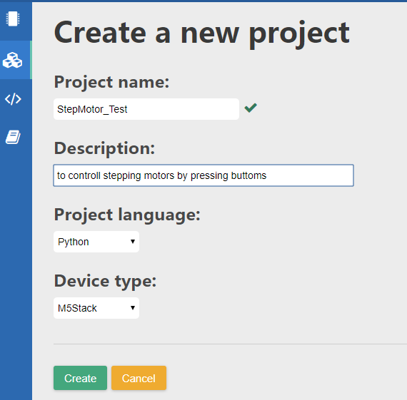
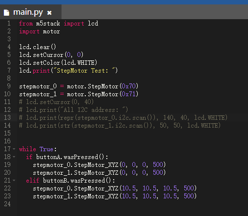

# M5Stack StepMotor Module Startup

After M5Stack Core board being connected to your WIFI network and your browser being logging in M5Cloud IDE, new a stepping motor project as shown below.




### 1. copy the below code to `main.py` and save it.

```python

from m5stack import lcd
import motor 

lcd.clear()
lcd.setCursor(0, 0)
lcd.setColor(lcd.WHITE)
lcd.print("StepMotor Test: ")

stepmotor_0 = motor.StepMotor(0x70)
stepmotor_1 = motor.StepMotor(0x71)
# lcd.setCursor(0, 40)
# lcd.print("All I2C address: ")
# lcd.print(repr(stepmotor_0.i2c.scan()), 140, 40, lcd.WHITE)
# lcd.print(str(stepmotor_1.i2c.scan()), 50, 50, lcd.WHITE)


while True:
  if buttonA.wasPressed(): 
    stepmotor_0.StepMotor_XYZ(0, 0, 0, 500)
    stepmotor_1.StepMotor_XYZ(0, 0, 0, 500)
  elif buttonB.wasPressed():
    stepmotor_0.StepMotor_XYZ(10.5, 10.5, 10.5, 500)
    stepmotor_1.StepMotor_XYZ(10.5, 10.5, 10.5, 500)

```

Now, your `main.py` file likes: 




### 2. Add motor module files
 
click `Upload Local File` and choose module files `i2c_bus.py` and `motor.py` as shown below


Now, your project windows likes: 


### 3. Upload project

press `Upload & Run` on M5Cloud IDE


After M5Stack Core board rebooting, if you can press buttom `A`(or `B`), stepping motors will rotate steadily.